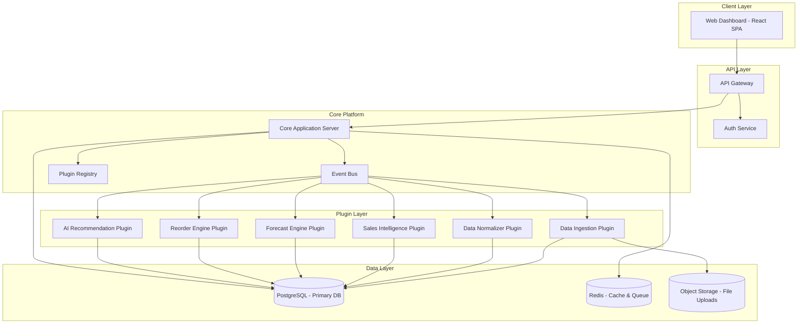
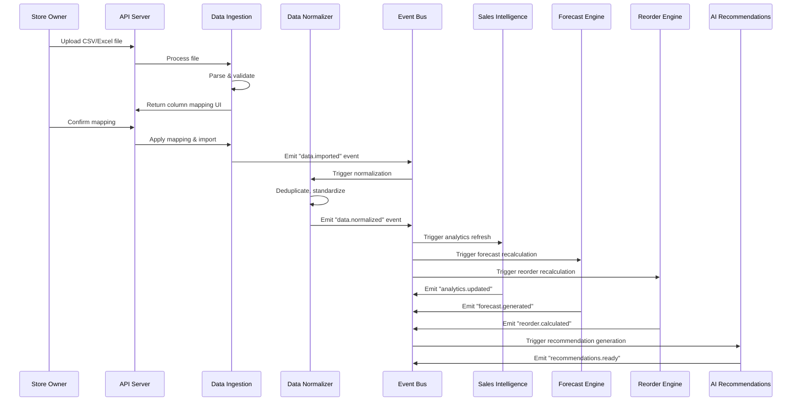
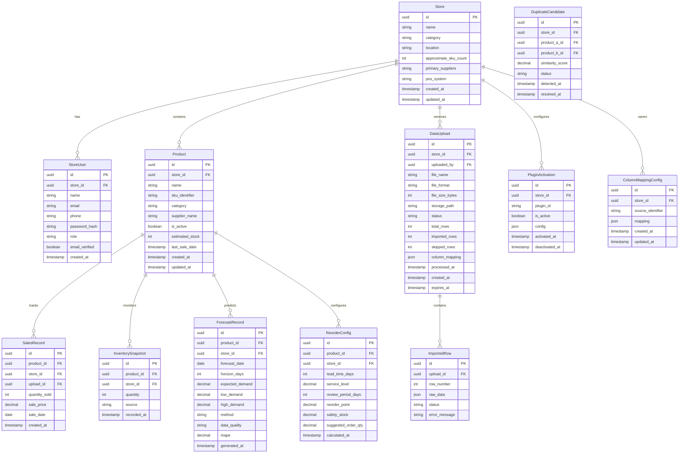

# Design Document: Grocery Inventory Intelligence

## Overview

Grocery Inventory Intelligence is a multi-tenant SaaS platform that provides an AI-powered inventory intelligence layer for independent grocery stores. The system ingests sales and inventory data from CSV/Excel uploads (Phase 1) and POS integrations (Phase 2), normalizes messy data, and delivers analytics, demand forecasting, reorder optimization, and purchasing recommendations through a web-based dashboard.

The architecture follows a modular plugin-based design, where data ingestion, analytics engines, forecast models, and notification channels are implemented as isolated plugins communicating through an event bus. This enables extensibility without modifying core platform logic.

### Key Design Decisions

1. **Plugin-first architecture**: All major subsystems (data ingestion, analytics, forecasting, recommendations) are plugins conforming to standard interfaces, enabling independent development and per-store activation.
2. **Event-driven communication**: A central event bus decouples plugins, allowing asynchronous processing and fault isolation.
3. **Multi-tenant data isolation**: Each store's data is logically isolated at the database level with row-level security, ensuring no cross-tenant data leakage.
4. **Offline-first analytics**: Pre-computed aggregations and materialized views enable sub-3-second dashboard rendering without expensive real-time queries.
5. **Progressive enhancement**: The platform functions fully with CSV uploads, with POS integrations adding automation on top of the same data pipeline.

## Architecture

### High-Level Architecture Diagram



### Technology Stack

| Layer | Technology | Rationale |
|-------|-----------|-----------|
| Frontend | React + TypeScript | Component-based UI, strong typing, large ecosystem |
| API | Node.js + Express/Fastify | Fast I/O, shared language with frontend, good library support for file parsing |
| Database | PostgreSQL | ACID compliance, JSON support, row-level security, excellent for analytics queries |
| Cache/Queue | Redis | In-memory speed for caching dashboard data, pub/sub for event bus |
| Object Storage | AWS S3 / MinIO | Scalable file storage for uploads, configurable retention |
| File Parsing | Papa Parse (CSV), ExcelJS (XLSX) | Battle-tested libraries for spreadsheet parsing |
| Auth | JWT + bcrypt | Stateless auth, industry standard |
| Deployment | Docker + AWS ECS | Containerized, scalable, manageable |

### Data Flow



## Components and Interfaces

### Plugin Interface Contracts

All plugins must implement the base `Plugin` interface:

```typescript
interface Plugin {
  id: string;
  name: string;
  version: string;
  dependencies: string[];
  
  initialize(config: PluginConfig): Promise<void>;
  execute(context: ExecutionContext): Promise<PluginResult>;
  shutdown(): Promise<void>;
  healthCheck(): Promise<HealthStatus>;
}

interface PluginConfig {
  storeId: string;
  settings: Record<string, unknown>;
}

interface PluginResult {
  success: boolean;
  data?: unknown;
  errors?: PluginError[];
}

interface PluginError {
  code: string;
  message: string;
  recoverable: boolean;
}

interface HealthStatus {
  healthy: boolean;
  lastExecution?: Date;
  errorCount: number;
}
```

### Plugin Registry

```typescript
interface PluginRegistry {
  register(plugin: Plugin): Promise<RegistrationResult>;
  unregister(pluginId: string): Promise<void>;
  activate(pluginId: string, storeId: string): Promise<void>;
  deactivate(pluginId: string, storeId: string): Promise<void>;
  getActivePlugins(storeId: string): Promise<Plugin[]>;
  validateContract(plugin: Plugin): ValidationResult;
}

interface RegistrationResult {
  success: boolean;
  pluginId: string;
  validationErrors?: string[];
}
```

### Event Bus Interface

```typescript
interface EventBus {
  publish(event: SystemEvent): Promise<void>;
  subscribe(eventType: string, handler: EventHandler): Subscription;
  unsubscribe(subscription: Subscription): void;
}

interface SystemEvent {
  type: string;
  storeId: string;
  pluginId: string;
  payload: unknown;
  timestamp: Date;
  correlationId: string;
}

type EventHandler = (event: SystemEvent) => Promise<void>;

// Standard event types
type EventType = 
  | 'data.imported'
  | 'data.normalized'
  | 'analytics.updated'
  | 'forecast.generated'
  | 'reorder.calculated'
  | 'recommendations.ready'
  | 'plugin.activated'
  | 'plugin.deactivated'
  | 'plugin.failed';
```

### Data Ingestion Plugin Interface

```typescript
interface DataIngestionPlugin extends Plugin {
  supportedFormats(): FileFormat[];
  parseFile(file: UploadedFile): Promise<ParseResult>;
  suggestColumnMapping(headers: string[]): Promise<ColumnMapping[]>;
  applyMapping(data: RawRow[], mapping: ColumnMapping[]): Promise<MappedRow[]>;
  validateRows(rows: MappedRow[]): Promise<ValidationResult>;
}

interface ParseResult {
  headers: string[];
  sampleRows: RawRow[];  // First 10 rows for preview
  totalRows: number;
  detectedFormat: FileFormat;
}

interface ColumnMapping {
  sourceColumn: string;
  targetField: StandardField;
  confidence: number;
  transform?: TransformFunction;
}

type StandardField = 
  | 'product_name' 
  | 'sku_id' 
  | 'quantity_sold' 
  | 'sale_price' 
  | 'sale_date' 
  | 'category' 
  | 'supplier_name';
```

### Data Normalizer Interface

```typescript
interface DataNormalizerPlugin extends Plugin {
  detectDuplicates(products: Product[], threshold: number): Promise<DuplicatePair[]>;
  standardizeDate(input: string): Promise<NormalizedDate | null>;
  standardizeCurrency(input: string): Promise<number | null>;
  calculateQualityScore(records: ImportedRecord[]): Promise<QualityScore>;
  flagAnomalies(records: ImportedRecord[]): Promise<AnomalyReport>;
}

interface DuplicatePair {
  productA: Product;
  productB: Product;
  similarityScore: number;
  suggestedMerge: Product;
}

interface QualityScore {
  overall: number;  // 0-100
  completeness: number;
  consistency: number;
  validity: number;
  details: QualityDetail[];
}
```

### Forecast Engine Interface

```typescript
interface ForecastPlugin extends Plugin {
  generateForecast(sku: SKU, horizon: 7 | 14): Promise<Forecast>;
  calculateAccuracy(skuId: string, period: DateRange): Promise<ForecastAccuracy>;
}

interface Forecast {
  skuId: string;
  horizon: number;
  predictions: DailyPrediction[];
  confidence: ConfidenceInterval;
  method: ForecastMethod;
  dataQuality: 'full' | 'limited';
}

interface DailyPrediction {
  date: Date;
  expectedDemand: number;
  low: number;
  high: number;
}

interface ForecastAccuracy {
  mape: number;  // Mean Absolute Percentage Error
  period: DateRange;
  sampleSize: number;
}
```

### Reorder Engine Interface

```typescript
interface ReorderPlugin extends Plugin {
  calculateReorderPoint(sku: SKU, config: ReorderConfig): Promise<ReorderPoint>;
  calculateSafetyStock(sku: SKU, serviceLevel: number): Promise<number>;
  calculateOrderQuantity(sku: SKU, config: ReorderConfig): Promise<number>;
  getReorderRecommendations(storeId: string): Promise<ReorderRecommendation[]>;
}

interface ReorderConfig {
  leadTimeDays: number;
  serviceLevel: number;  // 0.0-1.0, default 0.95
  reviewPeriodDays: number;  // default 7
}

interface ReorderPoint {
  skuId: string;
  reorderPoint: number;
  safetyStock: number;
  averageDailySales: number;
  leadTimeDays: number;
  daysUntilStockout: number | null;
}

interface ReorderRecommendation {
  skuId: string;
  productName: string;
  currentStock: number;
  reorderPoint: number;
  suggestedQuantity: number;
  urgency: 'critical' | 'high' | 'medium' | 'low';
  estimatedStockoutDate: Date | null;
}
```

### AI Recommendation Engine Interface

```typescript
interface RecommendationPlugin extends Plugin {
  generateRecommendations(storeId: string): Promise<RecommendationSet>;
}

interface RecommendationSet {
  restockNow: Recommendation[];      // up to 10
  reduceOrRemove: Recommendation[];   // up to 10
  promoteThisWeek: Recommendation[];  // up to 5
  generatedAt: Date;
  dataRange: DateRange;
}

interface Recommendation {
  skuId: string;
  productName: string;
  type: 'restock' | 'reduce' | 'promote';
  confidence: 'low' | 'medium' | 'high';
  explanation: string;
  supportingMetrics: Record<string, number>;
}
```

## Data Models

### Entity Relationship Diagram



### Key Data Models (TypeScript)

```typescript
// Core domain models

interface Store {
  id: string;
  name: string;
  category: 'grocery' | 'specialty' | 'general';
  location: string;
  approximateSkuCount: number;
  primarySuppliers: string[];
  posSystem: string | null;
  createdAt: Date;
  updatedAt: Date;
}

interface Product {
  id: string;
  storeId: string;
  name: string;
  skuIdentifier: string | null;
  category: string | null;
  supplierName: string | null;
  isActive: boolean;
  estimatedStock: number;
  lastSaleDate: Date | null;
  createdAt: Date;
  updatedAt: Date;
}

interface SalesRecord {
  id: string;
  productId: string;
  storeId: string;
  uploadId: string;
  quantitySold: number;
  salePrice: number;
  saleDate: Date;
  createdAt: Date;
}

interface DataUpload {
  id: string;
  storeId: string;
  uploadedBy: string;
  fileName: string;
  fileFormat: 'csv' | 'xlsx' | 'xls';
  fileSizeBytes: number;
  storagePath: string;
  status: 'pending' | 'parsing' | 'mapping' | 'processing' | 'completed' | 'failed';
  totalRows: number;
  importedRows: number;
  skippedRows: number;
  columnMapping: ColumnMapping[] | null;
  processedAt: Date | null;
  createdAt: Date;
  expiresAt: Date;  // 90 days after upload
}

interface QualityScore {
  overall: number;
  completeness: number;
  consistency: number;
  validity: number;
}

interface DailyAnalytics {
  storeId: string;
  date: Date;
  totalRevenue: number;
  totalUnitsSold: number;
  averageTransactionValue: number;
  uniqueSkusSold: number;
}

interface RecommendationRecord {
  id: string;
  storeId: string;
  type: 'restock' | 'reduce' | 'promote';
  skuId: string;
  productName: string;
  confidence: 'low' | 'medium' | 'high';
  explanation: string;
  supportingMetrics: Record<string, number>;
  generatedAt: Date;
  expiresAt: Date;
}
```

## Correctness Properties

*A property is a characteristic or behavior that should hold true across all valid executions of a system — essentially, a formal statement about what the system should do. Properties serve as the bridge between human-readable specifications and machine-verifiable correctness guarantees.*

### Property 1: Column Mapping Round-Trip

*For any* valid column mapping configuration, saving the mapping and then loading it for the same source identifier should produce an identical mapping configuration.

**Validates: Requirements 2.4**

### Property 2: Row Validation Partitioning

*For any* set of imported data rows, the row validation process should produce a partition where: (a) imported_count + skipped_count = total_count, (b) every imported row contains all required fields (product_name, quantity_sold), and (c) every skipped row is missing at least one required field.

**Validates: Requirements 2.5, 2.6**

### Property 3: Fuzzy Duplicate Detection Threshold

*For any* two product names and a similarity threshold, the duplicate detector should flag the pair as a duplicate if and only if their computed similarity score is >= the threshold.

**Validates: Requirements 3.1**

### Property 4: Date Format Standardization Round-Trip

*For any* valid date value formatted in any of the supported input formats (MM/DD/YYYY, DD/MM/YYYY, YYYY-MM-DD, DD-Mon-YYYY), parsing the formatted string should produce the original date value.

**Validates: Requirements 3.3**

### Property 5: Currency Value Standardization Round-Trip

*For any* numeric value formatted with currency symbols ($, €, £) and/or comma-separated thousands, the currency parser should extract the correct numeric value equal to the original.

**Validates: Requirements 3.4**

### Property 6: Date Range Validation

*For any* date value, the normalizer should flag it for review if and only if the date is in the future or more than 5 years in the past relative to the processing date.

**Validates: Requirements 3.5**

### Property 7: Data Quality Score Invariants

*For any* set of imported records, the quality score should satisfy: (a) overall score is in the range [0, 100], (b) completeness, consistency, and validity sub-scores are each in [0, 100], and (c) a dataset with all required fields filled should score higher on completeness than one with missing fields.

**Validates: Requirements 3.6**

### Property 8: Sales Summary Aggregation

*For any* set of sales records within a date range, total_revenue should equal the sum of (quantity_sold × sale_price) for each record, total_units should equal the sum of quantity_sold, and unique_skus should equal the count of distinct product IDs.

**Validates: Requirements 4.1**

### Property 9: Top-N Product Ranking

*For any* set of products with sales data, the top-20 list sorted by revenue (or units) should be in descending order, contain at most 20 items, and no excluded product should have a higher value than the lowest-ranked included product.

**Validates: Requirements 4.2**

### Property 10: Dead Stock Identification

*For any* set of products with sales history, the dead stock list should contain exactly those products with zero sales in the last 30 days, and the list should be sorted by last sale date in ascending order.

**Validates: Requirements 4.3**

### Property 11: Inventory Calculation and Status Classification

*For any* product with an initial stock count and a sequence of sales records, the estimated stock should equal initial_stock minus the sum of quantities sold. Furthermore, status classification should be: "In Stock" when estimated_stock > reorder_point, "Low Stock" when 0 < estimated_stock <= reorder_point, and "Out of Stock" when estimated_stock <= 0.

**Validates: Requirements 5.1, 5.2**

### Property 12: Restock Recommendations Selection

*For any* set of products with velocity and stock data, the "Restock Now" recommendation list should: (a) contain at most 10 items, (b) only include products where estimated days-of-supply is critically low, and (c) no excluded product with lower days-of-supply than any included product should exist.

**Validates: Requirements 6.1**

### Property 13: Reduce/Remove Recommendations Selection

*For any* set of products with 60-day sales history, the "Reduce or Remove" recommendation list should: (a) contain at most 10 items, and (b) only include products with a declining sales velocity trend over the past 60 days.

**Validates: Requirements 6.2**

### Property 14: Promote Recommendations Selection

*For any* set of products with recent sales data, the "Promote This Week" recommendation list should: (a) contain at most 5 items, and (b) only include products with a rising sales velocity.

**Validates: Requirements 6.3**

### Property 15: Recommendation Structural Invariants

*For any* generated recommendation (restock, reduce, or promote), the recommendation should have: (a) a confidence value in {low, medium, high}, (b) a non-empty explanation string, and (c) only reference SKUs with at least 14 days of sales history.

**Validates: Requirements 6.4, 6.5**

### Property 16: Forecast Data Sufficiency Handling

*For any* SKU, the forecast engine should: (a) generate forecasts with exactly 7 or 14 daily predictions only when the SKU has >= 30 days of history marked as "full" quality, and (b) produce a "limited data estimate" labeled forecast using category averages when history is < 30 days.

**Validates: Requirements 7.1, 7.5**

### Property 17: Forecast Confidence Interval Ordering

*For any* generated forecast, each daily prediction should satisfy: low <= expected <= high.

**Validates: Requirements 7.4**

### Property 18: Forecast Accuracy (MAPE) Calculation

*For any* set of forecast/actual value pairs where all actuals are non-zero, the calculated MAPE should equal mean(|actual - forecast| / |actual|) × 100.

**Validates: Requirements 7.6**

### Property 19: Reorder Point and Safety Stock Calculation

*For any* product with known average daily sales, lead time, demand standard deviation, and service level, the reorder point should equal (average_daily_sales × lead_time_days) + safety_stock, where safety_stock = z_score(service_level) × demand_std_dev × sqrt(lead_time_days).

**Validates: Requirements 8.1, 8.2**

### Property 20: Default Lead Time Assignment

*For any* product without an explicitly configured lead time, the system should assign a default of 3 days if the supplier is local, or 7 days if the supplier is non-local.

**Validates: Requirements 8.4**

### Property 21: Order Quantity Calculation

*For any* product with known average daily sales, lead time, and review period, the suggested order quantity should equal average_daily_sales × (lead_time_days + review_period_days) - current_stock + safety_stock.

**Validates: Requirements 8.5**

### Property 22: Reorder List Urgency Sorting

*For any* list of reorder recommendations, the list should be sorted in ascending order of estimated days until stockout (most urgent first).

**Validates: Requirements 8.6**

### Property 23: Plugin Contract Validation

*For any* object submitted for plugin registration, the registry should accept it if and only if it implements all required interface methods (initialize, execute, shutdown, healthCheck) and has valid id, name, and version fields.

**Validates: Requirements 9.3**

### Property 24: Plugin Per-Store Isolation

*For any* two stores and any plugin, activating or deactivating the plugin for one store should not change the plugin's activation status for the other store.

**Validates: Requirements 9.4**

### Property 25: Event Bus Delivery

*For any* published event and set of subscribers, every subscriber registered for that event type should receive the event, and no subscriber registered for a different event type should receive it.

**Validates: Requirements 9.5**

### Property 26: Plugin Fault Isolation

*For any* plugin that throws an error during execution, the core system should remain healthy, and all other active plugins should continue functioning without degradation.

**Validates: Requirements 9.6**

### Property 27: Tenant Data Isolation

*For any* store's data and any user from a different store, access attempts to the first store's data should be denied, regardless of the API endpoint or query parameters used.

**Validates: Requirements 10.3, 10.4**

## Error Handling

### Error Categories and Strategies

| Category | Examples | Strategy |
|----------|----------|----------|
| **File Processing Errors** | Corrupt file, unsupported format, oversized file | Reject immediately with descriptive message; no partial processing |
| **Data Validation Errors** | Missing required fields, invalid dates, malformed currency | Skip invalid rows, continue processing valid ones, report summary |
| **Normalization Errors** | Ambiguous date format, unparseable currency | Flag for manual review, do not auto-correct uncertain values |
| **Calculation Errors** | Division by zero (velocity calc), insufficient data | Use safe defaults or skip calculation; clearly label limitations |
| **Plugin Errors** | Plugin crash, timeout, interface violation | Isolate failure, deactivate plugin, log error, notify admin |
| **Authentication Errors** | Invalid token, expired session | Return 401, redirect to login; never expose protected data |
| **Authorization Errors** | Cross-tenant access attempt | Return 403, log security event; escalate repeated attempts |
| **External Service Errors** | S3 unavailable, Redis timeout | Retry with exponential backoff (max 3 retries), degrade gracefully |

### Error Response Format

```typescript
interface ErrorResponse {
  error: {
    code: string;           // Machine-readable: "FILE_TOO_LARGE", "INVALID_FORMAT"
    message: string;        // Human-readable explanation
    details?: unknown;      // Additional context (field-level errors, etc.)
    retryable: boolean;     // Whether the client should retry
    suggestedAction?: string; // What the user can do to fix it
  };
  requestId: string;        // For support/debugging
  timestamp: Date;
}
```

### Graceful Degradation

- **Dashboard**: If analytics computation is delayed, show last-known-good data with a "last updated" timestamp
- **Forecasting**: If forecast engine fails, the dashboard continues to show historical data without predictions
- **Recommendations**: If AI engine fails, display "recommendations temporarily unavailable" without affecting other dashboard sections
- **File Upload**: If storage upload fails, retain the file in memory/temp for retry; never lose user data without notification

### Data Integrity Safeguards

- All database writes use transactions; partial imports are rolled back on failure
- Idempotent import operations: re-uploading the same file does not create duplicate records
- Optimistic locking on product and inventory records to prevent concurrent update conflicts
- Audit log for all data mutations (who, when, what changed)

## Testing Strategy

### Testing Approach

The testing strategy employs a dual approach:
- **Property-based tests** for universal correctness guarantees across all valid inputs
- **Unit tests** for specific examples, edge cases, and integration points

### Property-Based Testing

**Library**: [fast-check](https://github.com/dubzzz/fast-check) (TypeScript/JavaScript)

**Configuration**:
- Minimum 100 iterations per property test
- Each property test references its design document property
- Tag format: `Feature: grocery-inventory-intelligence, Property {number}: {property_text}`

**Property tests cover:**
- Data normalization (date parsing, currency parsing, fuzzy dedup)
- Mathematical calculations (reorder points, safety stock, MAPE, EOQ)
- Aggregation correctness (sales summaries, rankings, dead stock identification)
- Classification logic (inventory status, recommendation selection)
- Structural invariants (confidence intervals, quality score bounds, recommendation structure)
- Plugin system (contract validation, event bus delivery, fault isolation, tenant isolation)

### Unit Tests

Unit tests focus on:
- **Specific examples**: Known CSV files parse correctly, specific date strings normalize correctly
- **Edge cases**: Empty files, files at exactly 50MB, dates on boundary (exactly 5 years ago), zero-stock items
- **Error conditions**: Corrupt files, unsupported formats, missing required fields, invalid tokens
- **Integration points**: API endpoint behavior, database query correctness, event emission

### Integration Tests

Integration tests verify:
- End-to-end file upload flow (upload → parse → map → normalize → analytics update)
- Authentication and authorization across all endpoints
- Event bus message delivery between real plugin instances
- Database migration correctness
- Performance SLAs (dashboard render < 3s, file parse < 10s for files < 10MB)

### Test Organization

```
tests/
├── unit/
│   ├── ingestion/
│   ├── normalizer/
│   ├── analytics/
│   ├── forecast/
│   ├── reorder/
│   ├── recommendations/
│   └── plugins/
├── property/
│   ├── normalizer.property.test.ts
│   ├── analytics.property.test.ts
│   ├── forecast.property.test.ts
│   ├── reorder.property.test.ts
│   ├── recommendations.property.test.ts
│   └── plugins.property.test.ts
└── integration/
    ├── upload-flow.test.ts
    ├── auth.test.ts
    ├── event-bus.test.ts
    └── performance.test.ts
```

